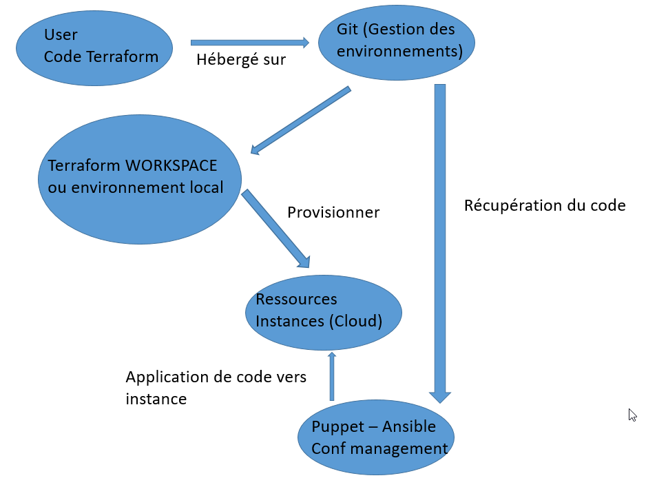

---
# Présentation réaliser en colaboration avec :
# Justine Luc
# Benjamin Lallemand
# Logan Smague
marp: true
paginate: true
#Image Background : https://pixabay.com/
backgroundImage: url('image.jpg')
color: #ffffff

---
# DevOps en entreprise
Comment implementer le DevOps dans une entreprise ?

---

## étape 1 : Formation des collaborateurs

- implémenter la collaboration étroite entre les équipes de développement, d'exploitation et de qualité
- Former les membres de l'équipe aux outils et aux processus DevOps
- Définir en claire les rôles et les responsabilités

---

## étape 2 : Mise en place des processus

- Planification et développement
- Intégration continue
- Livraison continue
- Déploiement
- Surveillance et maintenance

---
## étape 3 : Mise en place des technologies

- Code : Git /Github
- Plan : terraform 
- Provider : AWS, GCP, Etc ..-
- Configuration : Ansible, Puppet, Kubernetes/Helm 
- Observabilité : Splunk 
- Test de version : Github Action 
- Build du code : VSCode, Docker Desktop 

---

---

## Conclusion

DevOps est un processus qui implique non seulement des outils et des technologies, mais également des personnes et des processus. En suivant les meilleures pratiques de DevOps et en utilisant les bonnes technologies, les entreprises peuvent améliorer leur agilité, leur efficacité et leur qualité en livrant des applications de manière rapide et fiable.

Merci de votre attention !
